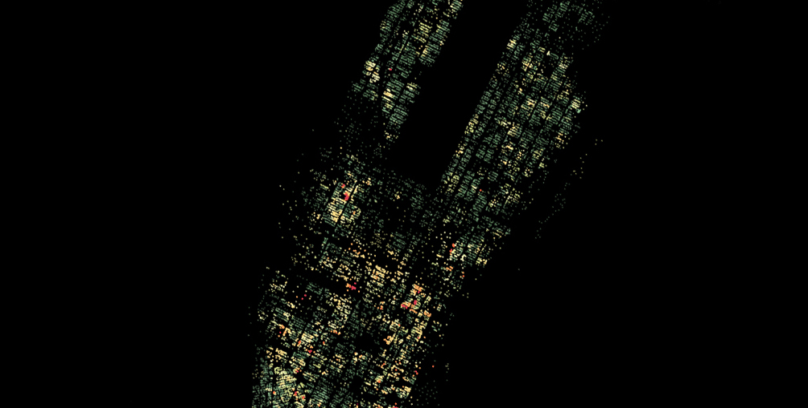

# Mahattan Rental Apartment Clustering

## Abstract:
A city functions like a gigantic sophisticate network. Within it each buildings and blocks are connected by visible transportation systems and invisible functional dependencies. But on the other hand, the difference of locations and functionality also divides the city into many sub-areas. For different purposes, the boundaries of these sub-areas are different. Like for political administration, we have boroughs, community districts and neighbourhoods, and for postal service, we have zip codes. 

In this projet, I would like to make use of rental apartment online listing dataset and new york building footprint dataset to explore the possible geographic boundaries or patterns of apartment rental market.

And we know that equivalent to finding boundaries, finding the best grouping of buildings with respect to their location and rental market popularity will help us understand the existing rental market data and get insights of its geographical form.

Performing unsupervised clustering technique, the direct problem we are facing is how to choose between a bunch of settings like different linkage, different distance metric etc. In this project, we are using 6 criteria including cluster sizes(data points count), cluster geometric area size, within cluster variance, between cluster variance etc. as 6 scoring systems. And through studying how these scoring system behaves and diverse, we are able to choose whether to fuse score of each system or to fuse rank of each system in choosing final clustering model settings.

And at last we compare how different rental listing features like doorman, fitness center, bedroom numbers etc affect the pattern of Manhattan apartment rental popularities.

## Files:
- **1_model selection.ipynb**: shows the process of clustering model selection
- **2_clustering.ipynb**: shows the how to make use of clustering to query information we are interested in and compare clusterings with different apartment properties.
- **interactive_clusters.py**: makes interactive plotting with the help of bokeh server. Issue command `bokeh serve --show interactive_clusters.py` in the command line, the plotting will be push to http://localhost:5006/, you can use web browser to see it.

## Dependencies:
This project uses third party library bokeh to perform visualization. To install bokeh, run `pip install bokeh` in command line.

## API References:
- scikit-learn: Fabian Pedregosa, Gaël Varoquaux, Alexandre Gramfort, Vincent Michel, Bertrand Thirion, Olivier Grisel, Mathieu Blondel, Peter Prettenhofer, Ron Weiss, Vincent Dubourg, Jake Vanderplas, Alexandre Passos, David Cournapeau, Matthieu Brucher, Matthieu Perrot, Édouard Duchesnay. Scikit-learn: Machine Learning in Python, Journal of Machine Learning Research, 12, 2825-2830 (2011)

- Bokeh: Bokeh Development Team (2014). Bokeh: Python library for interactive visualization. URL:http://www.bokeh.pydata.org.

- Pandas: Wes McKinney. Data Structures for Statistical Computing in Python, Proceedings of the 9th Python in Science Conference, 51-56 (2010)

- NumPy & SciPy: Stéfan van der Walt, S. Chris Colbert and Gaël Varoquaux. The NumPy Array: A Structure for Efficient Numerical Computation, Computing in Science & Engineering, 13, 22-30 (2011), DOI:10.1109/MCSE.2011.37

## License:
MIT License

Copyright (c) [2017] [Xian Lai]

Permission is hereby granted, free of charge, to any person obtaining a copy of this software and associated documentation files (the "Software"), to deal in the Software without restriction, including without limitation the rights
to use, copy, modify, merge, publish, distribute, sublicense, and/or sell copies of the Software, and to permit persons to whom the Software is
furnished to do so, subject to the following conditions:

The above copyright notice and this permission notice shall be included in all
copies or substantial portions of the Software.

THE SOFTWARE IS PROVIDED "AS IS", WITHOUT WARRANTY OF ANY KIND, EXPRESS OR
IMPLIED, INCLUDING BUT NOT LIMITED TO THE WARRANTIES OF MERCHANTABILITY,
FITNESS FOR A PARTICULAR PURPOSE AND NONINFRINGEMENT. IN NO EVENT SHALL THE
AUTHORS OR COPYRIGHT HOLDERS BE LIABLE FOR ANY CLAIM, DAMAGES OR OTHER
LIABILITY, WHETHER IN AN ACTION OF CONTRACT, TORT OR OTHERWISE, ARISING FROM,
OUT OF OR IN CONNECTION WITH THE SOFTWARE OR THE USE OR OTHER DEALINGS IN THE
SOFTWARE.

## Contact:
Xian Lai
Data Analytics, CIS @ Fordham University
XianLaaai@gmail.com

