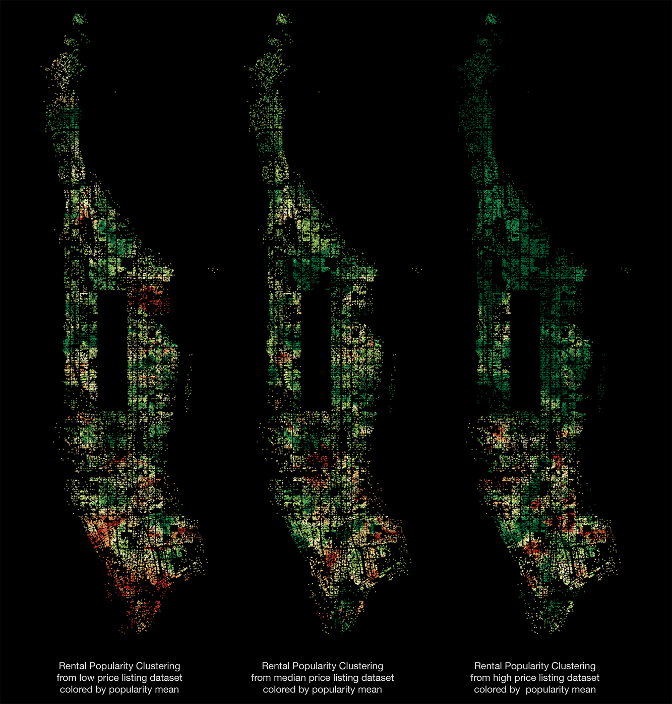

# Mahattan Rental Apartment Clustering
A city functions like a gigantic sophisticate network. Within it each buildings and blocks are connected by visible transportation systems and invisible functional dependencies. On the other hand, the difference of locations and functionality also divides the city into many sub-areas. 

For different purposes, the boundaries of these sub-areas are different. Like for political administration, we have boroughs, community districts and neighbourhoods, and for postal service, we have zip codes. 

In this projet, I made use of rental apartment online listing dataset and new york building footprint dataset to explore the possible geographic boundaries or patterns of apartment rental market. Equivalent to finding boundaries, clustering are performed to find the best grouping of buildings with respect to their location and rental market popularity and then we show how different properties like bedroom number, is there elevator in building, is there fitness center in building etc affect the clustering patterns.

## Synopsis:

This project is consist of 2 parts:

- **clustering model selection**  
    
    1. Interpolate the popularity of every building in the building dataset.

        Based on assumption that popularity of buildings are similar to their surrounding buildings', I use inverse distance weighting (IDW) as my interpolation method to get popularity value for each data point in building dataset from listing dataset.

    2. Cluster the buildings with location and popularity.
        
        With every building assigned popularity values, I performed hierarchical clustering using their longitude, latitude and the popularity.

    3. Evaluate the interpolation and clustering models with different parameter combination and select the best one for this project.
    
        In the previous 2 phases, there are 4 parameters: 

            - n_neighbors: number of neighbor building to consider during interpolating    
            - IDWpower: controlling power of IDW    
            - linkage: method to calculate distance between clusters    
            - metric: method to calculate distance between buildings    

        We use 6 criteria to evaluate each model. And through studying how these criteria behave and diverse, we choose whether to fuse score or rank of each scoring system for picking final model.

            - n_singlton : The number of singleton clusters.  
            - smClusterSize: The cluster size at the 15th percentile ranking from small to big.  
            - lgClusterSize: The cluster size at the 85th percentile ranking from small to big.  
            - lgClusterArea: The cluster area at the 85th percentile ranking from small to big.  
            - interVariance: The within cluster popularity variance.  
            - intraVariance: The between cluster popularity variance.  

- **Query clustering with different conditions**  
    
    1. Query clustering using cluster statistics

        In the process of clustering, we calculate some statistics for each cluster:

            - Popularity mean  
            - Popularity variance  
            - cluster size  
            - cluster area  

        We can either use them to filter clusters, (For example, we can filter out 100 clusters with highest popularities.) or use them as color coding to visualize these clusters. (For example, we can plot the clusters colored by their popularity mean.)
        
    2. Query clustering using different building properties
    
        Since the listing dataset contains information about building properties like price, fitness centers, bedroom numbers etc, we can produce different subset of listing data and interpolate the building popularity from this subset and hence get a different clustering. (For example, if we want to compare the clustering of high-price rentals to that of low-price rentals, we can create 2 subsets, get 2 clusterings and compare the difference in final plottings.)

## Files:
- **1_model selection.ipynb**:   
    shows the process of clustering model selection

- **2_clustering.ipynb**:   
    shows the how to make use of clustering to query information we are interested in and compare clusterings with different apartment properties.

- **interactive_clusters.py**:  
    makes interactive plotting using bokeh server.

    Besides making static plotting, we can also query the clustering interactively with the help of bokeh server. Simply run `$ bokeh serve --show interactive_clusters.py` in the command line, the interactive plotting will be availabel at http://localhost:5006/, you can use web browser to play with it.

## Dependencies:
This project uses third party library bokeh to perform visualization. To install bokeh, run `pip install bokeh` in command line.

## API References:
- scikit-learn: Fabian Pedregosa, Gaël Varoquaux, Alexandre Gramfort, Vincent Michel, Bertrand Thirion, Olivier Grisel, Mathieu Blondel, Peter Prettenhofer, Ron Weiss, Vincent Dubourg, Jake Vanderplas, Alexandre Passos, David Cournapeau, Matthieu Brucher, Matthieu Perrot, Édouard Duchesnay. Scikit-learn: Machine Learning in Python, Journal of Machine Learning Research, 12, 2825-2830 (2011)

- Bokeh: Bokeh Development Team (2014). Bokeh: Python library for interactive visualization. URL:http://www.bokeh.pydata.org.

- Pandas: Wes McKinney. Data Structures for Statistical Computing in Python, Proceedings of the 9th Python in Science Conference, 51-56 (2010)

- NumPy & SciPy: Stéfan van der Walt, S. Chris Colbert and Gaël Varoquaux. The NumPy Array: A Structure for Efficient Numerical Computation, Computing in Science & Engineering, 13, 22-30 (2011), DOI:10.1109/MCSE.2011.37

## License:
MIT License

Copyright (c) [2017] [Xian Lai]

Permission is hereby granted, free of charge, to any person obtaining a copy of this software and associated documentation files (the "Software"), to deal in the Software without restriction, including without limitation the rights
to use, copy, modify, merge, publish, distribute, sublicense, and/or sell copies of the Software, and to permit persons to whom the Software is
furnished to do so, subject to the following conditions:

The above copyright notice and this permission notice shall be included in all
copies or substantial portions of the Software.

THE SOFTWARE IS PROVIDED "AS IS", WITHOUT WARRANTY OF ANY KIND, EXPRESS OR
IMPLIED, INCLUDING BUT NOT LIMITED TO THE WARRANTIES OF MERCHANTABILITY,
FITNESS FOR A PARTICULAR PURPOSE AND NONINFRINGEMENT. IN NO EVENT SHALL THE
AUTHORS OR COPYRIGHT HOLDERS BE LIABLE FOR ANY CLAIM, DAMAGES OR OTHER
LIABILITY, WHETHER IN AN ACTION OF CONTRACT, TORT OR OTHERWISE, ARISING FROM,
OUT OF OR IN CONNECTION WITH THE SOFTWARE OR THE USE OR OTHER DEALINGS IN THE
SOFTWARE.

## Contact:
Xian Lai   
Data Analytics, CIS @ Fordham University   
XianLaaai@gmail.com   

