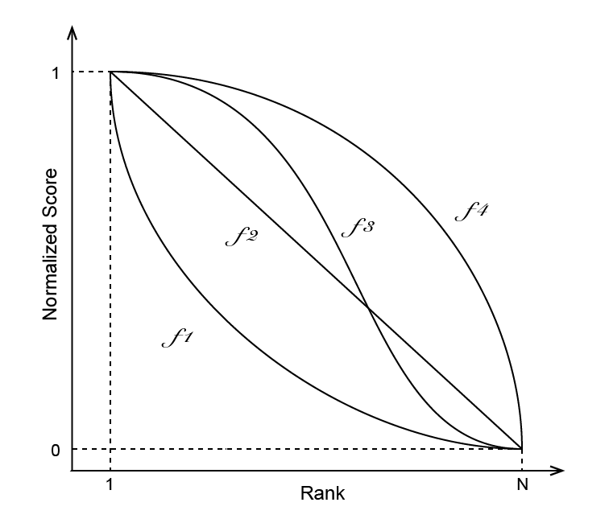
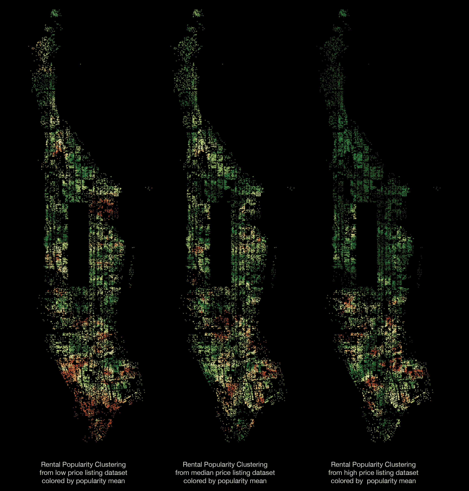

# Mahattan Rental Apartment Clustering
# 曼哈顿出租房源聚类分析

### Xian Lai
### 赖献

xian_lai@126.com

=======================================================


## Abstract
## 概要
A city functions like a gigantic sophisticate network. Within it buildings and blocks are connected by visible urban infrastructure systems and invisible functional dependencies. On the other hand, the difference of locations and functionality also divides the city into many regions. Under different fucntionality, the boundaries of these regions are different. For political administration, we have boroughs, community districts and neighbourhoods, for postal service, we have zip codes, etc. 

In this projet, I made use of rental apartment online listing dataset and New York building footprint dataset to explore the possible geographic boundaries or patterns of apartment rental market. Equivalent to finding boundaries, clustering are performed to find the best grouping of buildings with respect to their location and rental market popularity. Then we show how different properties like bedroom number, is there elevator in building, is there fitness center in building etc. can affect the clustering patterns.

Particularly, we are going to:

- Interpolate the popularity of every building in the building dataset.
- Select the best clustering model using a sample dataset.
- Perform the final model on the full dataset with different conditions we are interested in.

## Rental Apartments Listing Dataset
## 租房贴数据集

The listing dataset contains about 46,000 rental apartment online listings in Manhattan. Each listing containing information about rental apartments’ geographic location, popularity (defined by how many visits of listing webpage) and some other description features like facilities, number of bedrooms, bathrooms, rental price, etc. illustrated in following table.

| id | bathrooms | bedrooms | listing_time | features | x | y | price | popularity |
|:---:|:---------:|:--------:|:------------:|:------------------------------------------------------:|:-------------:|:------------:|:--------:|:----------:|
| 0 | 0.15 | 0.375 | 0.937237 |  | -8.231241e+06 | 4.970321e+06 | 0.000659 | 0.5 |
| 1 | 0.10 | 0.250 | 0.804684 | [doorman, elevator, fitness center, ...] | -8.233935e+06 | 4.982107e+06 | 0.001208 | 0.0 |
| 2 | 0.10 | 0.125 | 0.170960 | [laundry in building, ...] | -8.237843e+06 | 4.973891e+06 | 0.000625 | 1.0 |
| 3 | 0.10 | 0.125 | 0.181733 | [hard wood floors, no fee] | -8.234047e+06 | 4.976109e+06 | 0.000720 | 0.0 |
| 4 | 0.10 | 0.500 | 0.293677 | [pre-war] | -8.231998e+06 | 4.986431e+06 | 0.000737 | 0.5 |
| ... | ... | ... | ... | ... | ... | ... | ... | ... |


First of all, building or block is a better unit for clustering rather than apartment. Second, as the following figure shows, the listed apartments are dense in some popular areas, but sparse in others. To get a more comprehensive understanding of all neighborhoods in Manhattan. I immigrant the information from listings dataset to blocks dataset by interpolation.


## Model Setup and Selection
## 模型搭设与选择

### I. Model
### I. 模型

**Interpolation**

Assuming the popularity of rental apartment is geographically continuous, namely the popularity of one building is similar to surrounding buildings, I can interpolate the popularities of every building using the information from listing dataset. Then clustering will be performed on building dataset instead.

The popularity of a building is calculated from surrounding listed apartments based on the distance in space and time. Assuming y is our target building, <a href="http://www.codecogs.com/eqnedit.php?latex=${x_0,&space;x_1,&space;...,&space;x_n}$" target="_blank"></a> is the set of nearby apartments. <a href="http://www.codecogs.com/eqnedit.php?latex=$u(x_i)$" target="_blank"></a> is the popularity of <a href="http://www.codecogs.com/eqnedit.php?latex=$x$" target="_blank"></a>. We have the calculation formula:

If <a href="http://www.codecogs.com/eqnedit.php?latex=$d(y,x_i)&space;\neq&space;0$" target="_blank"></a> for all <a href="http://www.codecogs.com/eqnedit.php?latex=$x_i$" target="_blank"></a>:

<a href="http://www.codecogs.com/eqnedit.php?latex=$$u(y)=\frac{\sum_{i=1}^{n}&space;w(x_i)*u(x_i)}{\sum_{i=1}^{n}&space;w(x_i)}$$" target="_blank"></a>

where 

<a href="http://www.codecogs.com/eqnedit.php?latex=$$w(x_i)=\frac{1}{d(y,x_i)^p&space;\times&space;t}$$" target="_blank"></a>

If <a href="http://www.codecogs.com/eqnedit.php?latex=$d(y_k,x_i)&space;=&space;0$" target="_blank"></a> for some <a href="http://www.codecogs.com/eqnedit.php?latex=$x_i$" target="_blank"></a>:

<a href="http://www.codecogs.com/eqnedit.php?latex=$$u(y_k)=u(x_i)$$" target="_blank"></a>

**Clustering**

Then **hierarchical clustering** is performed on interpolated block dataset using their longitude, latitude and the popularity. The hierarchical clustering allows us to choose geographic granularity easily, so we gain different points of view from larger areas to small neighbourhoods.

For the clustering model, there are 2 hyperparameters to decide:

- **method**: Method to calculate distance between clusters.
- **metric**: Metric to calculate distance between data points.

Until now, we have 4 hyperparameters for our model: 

- radius : {0.005, 0.01, 0.05}
- IDWpower : {0.1, 0.5, 1.0, 3.0}
- method : {'average', 'weighted', 'complete', 'centroid'}
- metric : {'cityblock', 'euclidean'}

### II. Evaluation
### II. 评估方法

To select the best one from these 84 models, we use the following 6 criteria:

1. n_singlton : The number of singleton clusters.
2. smClusterSize: The cluster size at the 15th percentile ranking from small to big.
3. lgClusterSize: The cluster size at the 85th percentile ranking from small to big.
4. lgClusterArea: The cluster area at the 85th percentile ranking from small to big.
5. interVariance: The within cluster popularity variance.
6. intraVariance: The between cluster popularity variance.

The first 4 criteria evaluate whether a model yields balanced clustering with respect to both size and area. For this application, we don't want the clustering with a few large clusters and many small clusters.

The last 2 criteria evaluate whether a model put nearby buildings with similar popularity in the same cluster and the ones with different popularity into different clusters.

### III. Grid Search
### III. 网格式搜索参数空间

In the model testing, for each hyper-parameter combination, we performed clustering 100 times repetitively. In each repetition, the popularities of blocks were interpolated from 5000 listings sampled from the whole dataset, and the clustering stats were recorded. Here we load the clustering stats for comparison and final selection.

| param | interVariance | intraVariance | lgClusterArea | lgClusterSize | n_singlton | smClusterSize |
|:---------------------------------------------------------------------------:|:-------------:|:-------------:|:-------------:|:-------------:|:----------:|:-------------:|
| 'rad': 0.005, 'method': 'average', 'p': 0.1, 'metric': 'cityblock' | 0.484296 | 0.297020 | 0.557066 | 0.619772 | 0.590909 | 0.0 |
| 'rad': 0.01, 'method': 'average', 'p': 0.1, 'metric': 'cityblock' | 0.786169 | 0.599194 | 0.687356 | 0.315589 | 0.336364 | 0.0 |
| 'rad': 0.05, 'method': 'average', 'p': 0.1, 'metric': 'cityblock' | 0.996380 | 0.848915 | 0.859877 | 0.087452 | 0.136364 | 0.0 |
| ... | ... | ... | ... | ... | ... | ... |


### IV. Investigate the criteria behavior
### IV. 探索评估方法的给分习惯

Gaining the evaluation decisions given by 6 criteria for each clustering model, we need to find a way to combine them. There exist several different ways of combining the outputs of the scoring systems, including score combination, rank combination, voting, average combination, weighted combination etc. 

Here I use a scoring systems combination method introduced by Hsu and Taksa*:  
Let <a href="http://www.codecogs.com/eqnedit.php?latex=S_m(n)" target="_blank"></a> and <a href="http://www.codecogs.com/eqnedit.php?latex=R_m(n)" target="_blank"></a> be the score and rank given by <a href="http://www.codecogs.com/eqnedit.php?latex=m^{th}" target="_blank"></a> criterion on <a href="http://www.codecogs.com/eqnedit.php?latex=n^{th}" target="_blank"></a> model respectively. We will have <a href="http://www.codecogs.com/eqnedit.php?latex=S_m(n)&space;\in&space;[0,1]" target="_blank"></a> with highest scoring = 1 and <a href="http://www.codecogs.com/eqnedit.php?latex=R_m(n)&space;\in&space;[1,N]" target="_blank"></a> with highest ranking = 1. Then we can investigate the scoring behavior of different criterions defined by Rank-Score Characteristic(RSC):

<a href="http://www.codecogs.com/eqnedit.php?latex=RSC_m(n)&space;=&space;\frac{S_m(n)}{R_m(n)}" target="_blank"></a>

The RSC curves of each criterion will form rank-score graph that tells us how different each criterion deciding their scoring. The following picture is an illustration of 3 scoring systems. The scoring system who assigns scores in a linearly decreasing fashion will have a linear rank-score curve like $f_2$ does. The system who habitually assigns high scores to a large subset of its top ranked candidates will have a graph that is not a straight line, but has a low slope for the top ranked candidates and a higher slope for the remainder similar to $f_4$. A third class of scoring behavior is exemplified by $f_1$. In this case, the expert habitually gives higher scores to a small subset of its top ranked candidates and much lower scores to the rest. 


Hsu and Taksa indicate that a diversity measure based on the rank-score graph can be used to determine whether a score or rank fusion will produce a better result. **When the rank-score graphs of two systems are very SIMILAR, then a Score Combination will produce the best fusion. When the rank-score graphs are very DIFFERENT, then a Rank Combination produces the better result.**

\* Hsu, D.F. and Taksa, I., Comparing rank and score combination methods for data fusion in information retrieval.


As we plot the graph with ranking as x-axis and scoring as y-axis, we see that all 6 scoring systems have similar behavior pattern. They all prefer to give high scores to high rankings and give low scores to low rankings. That means they are all confident about their judging. And the confidence can be measured by the area under curve.


### V. Combine criteria
### V.  汇总评估结果

As we plot the graph with ranking as x-axis and scoring as y-axis, we see that all 6 scoring systems have similar behavior pattern. They all prefer to give high scores to high rankings and give low scores to low rankings. That means they are all confident about their judging. And the confidence can be measured by the area under curve(AUC). The smaller AUC is, the more confident this criterion is.


| criterion | mean | variance | scaled_mean | scaled_variance |
|:-------------:|:---------:|:--------:|:-----------:|:---------------:|
| interVariance | 49.609687 | 2.911415 | 1.000000 | 0.000000 |
| intraVariance | 36.799254 | 4.213632 | 0.604533 | 0.241197 |
| lgClusterArea | 48.013565 | 4.377829 | 0.950727 | 0.271610 |
| lgClusterSize | 49.508348 | 8.310380 | 0.996872 | 1.000000 |
| n_singlton | 46.693237 | 3.914928 | 0.909967 | 0.185871 |
| smClusterSize | 17.216520 | 8.304850 | 0.000000 | 0.998976 |

Here we see the mean AUC of some criteria are higher than the others. And some of them are more stable(small variance) than the others. Since mean and variance have different range, we minmax scale them first and then calculate the weighting for score combination using the fomulation:

<a href="http://www.codecogs.com/eqnedit.php?latex=weight_i&space;=&space;\frac{1}{(var_i&space;&plus;&space;1)&space;*&space;(mean_i&space;&plus;&space;1)}" target="_blank"></a>

<a href="http://www.codecogs.com/eqnedit.php?latex=\text{weightNorm}_i&space;=&space;\frac{weight_i}{\sum_i&space;weight_i}" target="_blank"></a>

<a href="http://www.codecogs.com/eqnedit.php?latex=\text{combinedScore}&space;=&space;\sum_i&space;{\text{weightNorm}_i&space;*&space;\text{scaledScore}_i}" target="_blank"></a>

| param | sampling_0 | sampling_1 | sampling_2 | ... | sampling_99 |
|:--------------------------------------:|:----------:|:----------:|:----------:|:---:|:-----------:|
| 'rad': 0.005, 'method': 'average', ... | 0.615136 | 0.621717 | 0.615491 | ... | 0.623939 |
| 'rad': 0.01, 'method': 'average', ... | 0.601919 | 0.678796 | 0.671904 | ... | 0.623398 |
| 'rad': 0.05, 'method': 'average', ... | 0.631742 | 0.643222 | 0.647827 | ... | 0.628623 |
| ... | ... | ... | ... | ... | ... |

After sorting by the mean combined score on 100 samplings, we can clearly see some models outperform the others. 


```python
[{'rad': 0.05, 'method': 'complete', 'IDWpower': 0.5, 'metric': 'cityblock'},
 {'rad': 0.05, 'method': 'complete', 'IDWpower': 1.0, 'metric': 'euclidean'},
 {'rad': 0.05, 'method': 'complete', 'IDWpower': 0.5, 'metric': 'euclidean'},
 {'rad': 0.05, 'method': 'complete', 'IDWpower': 0.1, 'metric': 'euclidean'},
 {'rad': 0.05, 'method': 'complete', 'IDWpower': 1.0, 'metric': 'cityblock'}]
```

## Clustering and Visualization
## 聚类分析和可视化

The rest is what this model can be used for. With the final parameters we picked, we can perform clustering on full building dataset and visualize the result.


### 1. Color the clusters by their statistics
### 1. 按组团统计特征上色

In the process of clustering, we calculate the following statistics for each cluster:

- Popularity mean  
- Popularity variance  
- cluster size  
- cluster area  

We can either use them to filter clusters, (For example, filter out 100 clusters with highest popularities.) or use them as color coding to visualize these clusters. (For example, plot the clusters colored by their popularity mean.)


### 2. Query clustering using different building properties
### 2. 按不同的建筑属性产生不同组团

Since the listing dataset contains information about building properties like price, fitness centers, bedroom numbers etc, we can produce different subset of listing data and interpolate the building popularity from this subset and hence get a different clustering. (For example, if we want to compare the clustering of high-price rentals to that of low-price rentals, we can create 2 subsets, get 2 clusterings and compare the difference in final plottings.)

As examples, we will compare the following clusters:
    - low price rentals vs high price rentals
    - 1-bedroom rentals, 2-bedroom rentals vs 4-bedroom rentals
    - rentals without elevators vs rentals with elevators




## Files
## 文件
- **Manhattan-Rental-Apartment-Clustering.ipynb**:   
    shows the process of clustering model selection and how to make use of clustering to query information we are interested in and compare clusterings with different apartment properties.

- **interactive_clusters.py**:  
    makes interactive plotting using bokeh server.

    Besides making static plotting, we can also query the clustering interactively with the help of bokeh server. Simply run `$ bokeh serve --show interactive_clusters.py` in the command line, the interactive plotting will be availabel at http://localhost:5006/, you can use web browser to play with it.


## Dependencies:
## 所使用的Python库
- scikit-learn: Fabian Pedregosa, Gaël Varoquaux, Alexandre Gramfort, Vincent Michel, Bertrand Thirion, Olivier Grisel, Mathieu Blondel, Peter Prettenhofer, Ron Weiss, Vincent Dubourg, Jake Vanderplas, Alexandre Passos, David Cournapeau, Matthieu Brucher, Matthieu Perrot, Édouard Duchesnay. Scikit-learn: Machine Learning in Python, Journal of Machine Learning Research, 12, 2825-2830 (2011)

- Bokeh: Bokeh Development Team (2014). Bokeh: Python library for interactive visualization. URL:http://www.bokeh.pydata.org. This project uses third party library bokeh to perform visualization. To install bokeh, run `pip install bokeh` in command line.

- Pandas: Wes McKinney. Data Structures for Statistical Computing in Python, Proceedings of the 9th Python in Science Conference, 51-56 (2010)

- NumPy & SciPy: Stéfan van der Walt, S. Chris Colbert and Gaël Varoquaux. The NumPy Array: A Structure for Efficient Numerical Computation, Computing in Science & Engineering, 13, 22-30 (2011), DOI:10.1109/MCSE.2011.37


## License:
## 使用许可证
MIT License

Copyright (c) [2017] [Xian Lai]

Permission is hereby granted, free of charge, to any person obtaining a copy of this software and associated documentation files (the "Software"), to deal in the Software without restriction, including without limitation the rights
to use, copy, modify, merge, publish, distribute, sublicense, and/or sell copies of the Software, and to permit persons to whom the Software is
furnished to do so, subject to the following conditions:

The above copyright notice and this permission notice shall be included in all
copies or substantial portions of the Software.

THE SOFTWARE IS PROVIDED "AS IS", WITHOUT WARRANTY OF ANY KIND, EXPRESS OR
IMPLIED, INCLUDING BUT NOT LIMITED TO THE WARRANTIES OF MERCHANTABILITY,
FITNESS FOR A PARTICULAR PURPOSE AND NONINFRINGEMENT. IN NO EVENT SHALL THE
AUTHORS OR COPYRIGHT HOLDERS BE LIABLE FOR ANY CLAIM, DAMAGES OR OTHER
LIABILITY, WHETHER IN AN ACTION OF CONTRACT, TORT OR OTHERWISE, ARISING FROM,
OUT OF OR IN CONNECTION WITH THE SOFTWARE OR THE USE OR OTHER DEALINGS IN THE
SOFTWARE.


